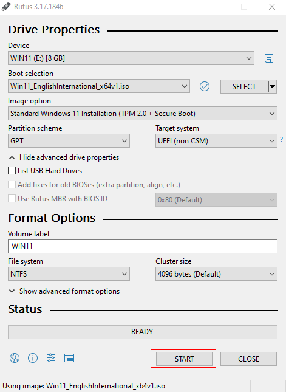
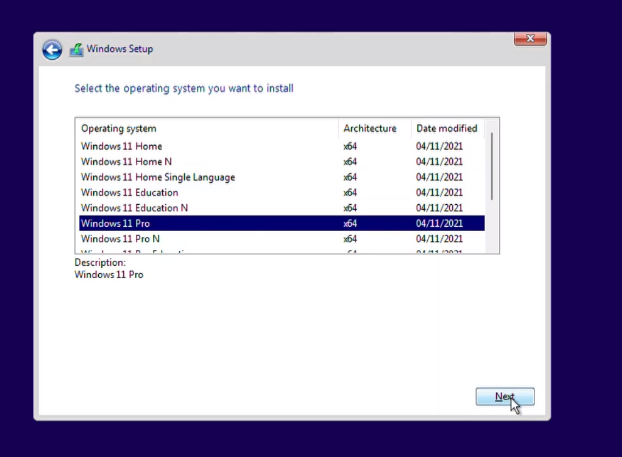
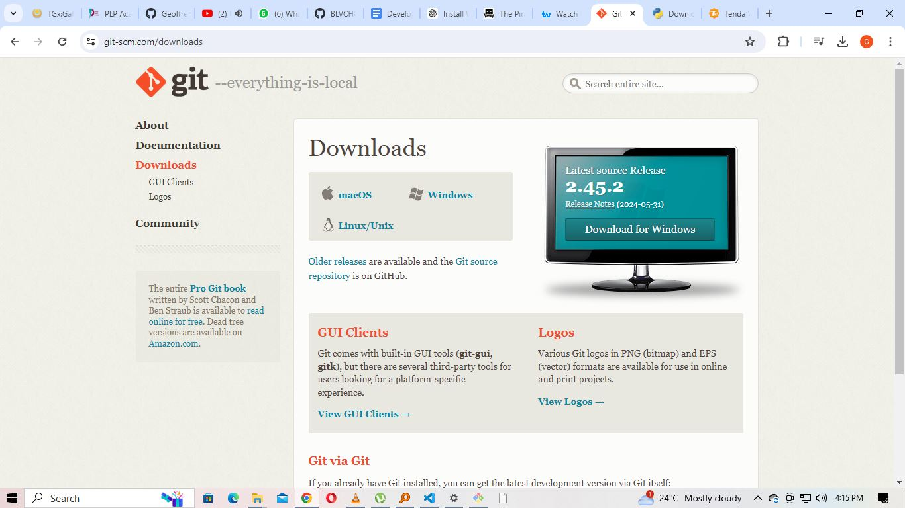
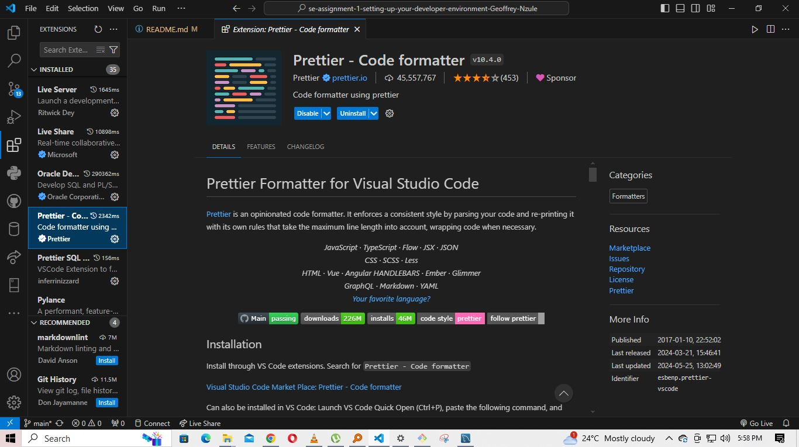

# Dev_Setup
Setup Development Environment

#Assignment: Setting Up Your Developer Environment

#Objective:
This assignment aims to familiarize you with the tools and configurations necessary to set up an efficient developer environment for software engineering projects. Completing this assignment will give you the skills required to set up a robust and productive workspace conducive to coding, debugging, version control, and collaboration.

#Tasks:

1. Select Your Operating System (OS):
   Choose an operating system that best suits your preferences and project requirements. Download and Install Windows 11. https://www.microsoft.com/software-download/windows11

First, ensure your system meets the minimum requirements for Windows 11:

Processor: 1 GHz or faster with at least two cores on a compatible 64-bit processor or System on a Chip (SoC).
RAM: 4 GB or more.
Storage: 64 GB or larger storage device.
Internet connection: Internet connectivity is necessary to perform updates and to download and take advantage of some features.

Step by step installation process.

Backup Data before the installation process to avoid data loss.

Download windows 11 installation media from microsoft and 'Download Windows 11 Disk image (ISO).

Create bootable usb drive and choose the iso image to burn the software.
-Upon completion insert the bootable usb drive into your computer.
-restart your computer and follow the on screen prompt to begin installation.

Select the partition where you want to install Windows 11
Click "Next" and the installation will begin.
After installation, your computer will restart.
Follow the on-screen instructions to set up your preferences, such as region, language, network settings, and Microsoft account.
Customize your Windows 11 settings as desired.

After installation, ensure you install the latest drivers and updates from Windows Update and the manufacturer's website for optimal performance.

2. Install a Text Editor or Integrated Development Environment (IDE):
   Select and install a text editor or IDE suitable for your programming languages and workflow. Download and Install Visual Studio Code. https://code.visualstudio.com/Download

Download Visual Studio Code

Go to the Visual Studio Code download page.
Click on the "Windows" download button to download the installer.

-once downloaded, click 'Run' read and accept terms and conditions then choose the default path installation then click 'Next'.

-Once the installation is complete, check the "Launch Visual Studio Code" box and click "Finish" to open Visual Studio Code

3. Set Up Version Control System:
   Install Git and configure it on your local machine. Create a GitHub account for hosting your repositories. Initialize a Git repository for your project and make your first commit. https://github.com

   Download Git in the offcial download page and run the downloaded file as you follow the instruction in the setup Wizard.

   

-First, pick where you want to put the program and then click Next.
-Next, choose what parts of the program you want to install (usually the default options are good enough) and click Next.
-After that, pick which editor you want to use with the program (like Visual Studio Code) and click Next.
-Make sure to use the recommended setting for adjusting your PATH environment and click Next.
-For the rest of the options, just stick with the default settings and click Install.
-Finally, click Finish when the installation is all done.

First things first, let's create a GitHub account. Head over to GitHub and click on Sign up to make a new account. Just follow the instructions to enter your email, make a password, and pick a cool username. Don't forget to verify your email address to finish setting up your account.

Next up, let's get your project organized. Open Git Bash and make a new directory for your project by typing in some commands. Then, inside your project directory, initialize a new Git repository. This will help keep track of all your changes and updates.

Now, it's time to create a README file to document your project. 

Last but not least, let's make your first commit. Start by adding the README file to the staging area, then commit the changes with a message. 

4. Install Necessary Programming Languages and Runtimes:
  Instal Python from http://wwww.python.org programming language required for your project and install their respective compilers, interpreters, or runtimes. Ensure you have the necessary tools to build and execute your code.

  

Download python  from the official page and run the installer file.
check and make sure that the 'Add python to PATH' in the installation window is checked.
install Python with default settings.

5. Install Package Managers:
   If applicable, install package managers like pip (Python).

First up, we have pip, which is like a magical package installer for Python. It usually comes with Python when you install it. And then there's virtual environments, which are super handy for keeping your projects organized.

To make sure pip is installed, just type this command:
pip --version

6. Configure a Database (MySQL):
   Download and install MySQL database. https://dev.mysql.com/downloads/windows/installer/5.7.html

   Install and download the setup in the offical website.

To set up MySQL Server and other tools for coding, choose the Developer Default option. Then, click Next.

Make sure your computer meets all the requirements by clicking Execute. If anything is missing, the installer will help you install it.

Next, pick the products and features you want, like MySQL Server and Workbench. Click Next and then Execute to get them.

For settings, choose Standalone MySQL Server, Development Computer, and Strong Password Encryption. Set up your accounts and roles, and decide if you want MySQL to run as a Windows service.
Finally, click Next and then Execute to finish applying the configuration.

7. Set Up Development Environments and Virtualization (Optional):
   Consider using virtualization tools like Docker or virtual machines to isolate project dependencies and ensure consistent environments across different machines.

8. Explore Extensions and Plugins:
   Explore available extensions, plugins, and add-ons for your chosen text editor or IDE to enhance functionality, such as syntax highlighting, linting, code formatting, and version control integration.

   Prettier is like a magical tool that helps make your code look super neat and organized. It works with lots of different programming languages and can be used with most editing programs. Basically, it takes your messy code and makes it all pretty and uniform so that everything looks nice and tidy in your project.
   

9. Document Your Setup:
    Create a comprehensive document outlining the steps you've taken to set up your developer environment. Include any configurations, customizations, or troubleshooting steps encountered during the process. 

#Deliverables:
- Document detailing the setup process with step-by-step instructions and screenshots where necessary.
- A GitHub repository containing a sample project initialized with Git and any necessary configuration files (e.g., .gitignore).
My GitHub repository sample project 

- A reflection on the challenges faced during setup and strategies employed to overcome them

Reflection on the challenges encoutered during installation of thee programs and plugins.
 1. windows installation challange where the operating system did not boot on the usb. The resolution to the error was to get a bigger usb drive to intialize the process.
 2.  Upon setting up Mysql, i forgot to include workbench feature to finish up the installation. 
 I resulted into downloading it separately and the installation was complete.

#Submission:
Submit your document and GitHub repository link through the designated platform or email to the instructor by the specified deadline.

#Evaluation Criteria:**
- Completeness and accuracy of setup documentation.
- Effectiveness of version control implementation.
- Appropriateness of tools selected for the project requirements.
- Clarity of reflection on challenges and solutions encountered.
- Adherence to submission guidelines and deadlines.

Note: Feel free to reach out for clarification or assistance with any aspect of the assignment.
